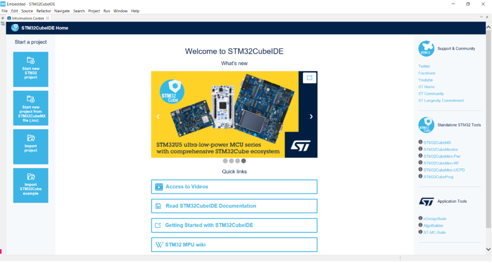

# Chapter 1. Hello world!

    

This chapter will walk you through setting up STM32CubeIDE for the first time and running HelloWorld on your board. This project uses the NUCLEO-F411RE board but this guide should be applicable to other STM as well.
Subchapters:

- Install STM32CubeIDE 
- Create a STM32 Project
- Toggle the on board LED every second.
- Toggle a external LED on a breadboard every second.
- Write “Hello There!” to putty over serial connection.

## Info: Install STM32CubeIDE
Download IDE from: https://www.st.com/en/development-tools/stm32cubeide.html

The STEM32CubeIDE contains presets for many stm32 boards as well as an easy to use interface to setup registers to peripherals and clock setup.

## Info: Create STM32 Project
To create your first STM32Project open 

    

## Project: Toggle the on board LED Every second

## Project: Toggle an external LED on a breadboard every second

## Project: Write "Hello There!" to putty over serial connection.

