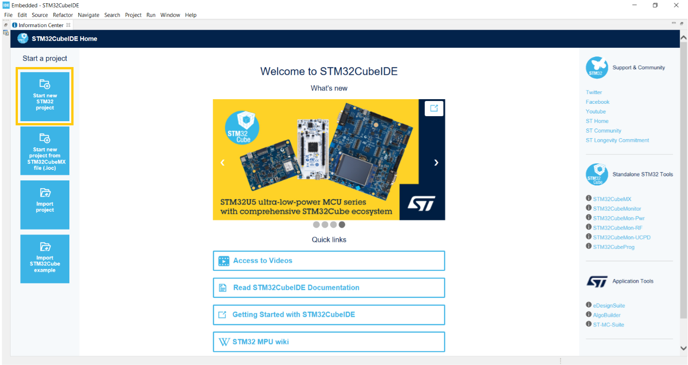

# Chapter 1. Hello world!


<p align="center">
    
</p>
This chapter will walk you through setting up STM32CubeIDE for the first time and running HelloWorld on your board. This project uses the NUCLEO-F411RE board but this guide should be applicable to other STM as well.
Subchapters:

- Install STM32CubeIDE 
- Create a STM32 Project
- Toggle the on board LED every second.
- Toggle a external LED on a breadboard every second.
- Write “Hello There!” to putty over serial connection.


## Info: Install STM32CubeIDE
Download IDE from: https://www.st.com/en/development-tools/stm32cubeide.html

The STEM32CubeIDE contains presets for many stm32 boards as well as an easy to use interface to setup registers to peripherals and clock setup.

## Info: Create STM32 Project
To create your first STM32Project open the STM32CubeIDE and press "Start New STM32 Project":
<p align="center">
    
</p>

In the window target select choose "Board selector" and type in your board name here shown with the NUCLE-F411RE development board:
 <p align="center">
    
</p>
In the next window the project is defined by naming it, choosing the language, if it is an executable or library file and if STM32 is the target. Fill in the details and press next:
<p align="center">
    
</p>
If this is the first time using a board the IDE will download the relevant board files and this might take a few minutes:
<p align="center">
    
</p>

Now the project is setup and the next step is to configure pins, write code and upload to the STM32.


## Exercise 1: Toggle the on board LED Every second

In the first exercise we are gonna toggle the on board LED. The first step is to find out which GPIO port and pin the led is located at. To find the pin configration open the project file and go to "Pinout & Configuration". In our case it is GPIOA pin5.
<p align="center">
    
</p>

Then go to main.c. Here it is important that you only write code inside the comments with "USER CODE BEGINS" else it will be deleted every time you change the configuration.
<p align="center">
    
</p>

To toggle the LED pin we are gonna use the HAL libray made by STM. HAL is a hardware abstraction layer, that will allow us to use the same methods over a series of microcontrollers. As shown below, we start with the method "HAL_PGIO_TogglePin and then tell it we want to toggle GPIOA, pin 5. Followed by a HAL_Delay of one second.
```c
  /* Infinite loop */
  /* USER CODE BEGIN WHILE */
  while (1)
  {
	  HAL_GPIO_TogglePin(GPIOA, GPIO_PIN_5);
	  HAL_Delay(1000);

    /* USER CODE END WHILE */

    /* USER CODE BEGIN 3 */
  }
  /* USER CODE END 3 */
}
```

## Exercise 2: Toggle an external LED on a breadboard every second

In this exercise an off-board LED will be toggled using the following setup:

<p align="center">
    
</p>

Then we need to assign a GPIO pin as a output, see image below.

<p align="center">
    
</p>

Then we repeart the same method as the one we used in the last exercise.

```c
  /* Infinite loop */
  /* USER CODE BEGIN WHILE */
  while (1)
  {
	  HAL_GPIO_TogglePin(GPIOA, GPIO_PIN_5);
      HAL_GPIO_TogglePin(GPIOA, GPIO_PIN_10);
	  HAL_Delay(1000);

    /* USER CODE END WHILE */

    /* USER CODE BEGIN 3 */
  }
  /* USER CODE END 3 */
}
```

## Exercise 3: Write "Hello There!" to putty over serial connection.

In this exercise we are gonna write a string from the MCU to your PC. In this example we are using a windows computer and putty. So the first step is to install [putty](https://www.putty.org/). Uart is setup by default, the init method can be found in the bottom of main.c.

The second step is creating a buffer for our string 

```c
int main(void)
{
  /* USER CODE BEGIN 1 */
	uint8_t buf[15];

  /* USER CODE END 1 */
```

Then using the Hal libray transmit our buffer 

``` c
  /* Infinite loop */
  /* USER CODE BEGIN WHILE */
  while (1)
  {
	  HAL_GPIO_TogglePin(GPIOA, GPIO_PIN_5);
	  HAL_GPIO_TogglePin(GPIOA, GPIO_PIN_10);

	  strcpy((char*)buf, "Hello there!\r\n");
	  HAL_UART_Transmit(&huart2, buf, strlen((char*)buf), HAL_MAX_DELAY);

	  HAL_Delay(1000);

    /* USER CODE END WHILE */

    /* USER CODE BEGIN 3 */
  }
  /* USER CODE END 3 */
}
```

We also need to include "string.h" to use strcpy

```c
/* Private includes ----------------------------------------------------------*/
/* USER CODE BEGIN Includes */
#include "string.h"
/* USER CODE END Includes */
```

The next step is to setup putty. First we need to look in device manager to find out which com port the nucleo borad is set to. 

<p align="center">
    
</p>

Then go into putty and set the Speed (Baud rate) to 115200 and the comport to the one you found in the device manager. 

<p align="center">
    
</p>

Now run your code and the MCU should print "Hello there!" and toggle the LED's every second.