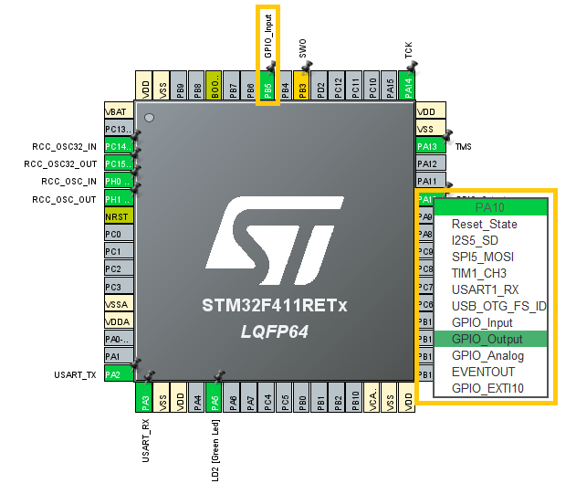

# Chapter 2. General-purpose input/output - GPIO

This chapter will show how to 

- Configure GPIO pins to input and output

- Set Pull-Down or Pull-up

- Configure GPIO speed

## Exercise 1: Configure one input and one output

First we need to find two GPIO pins that are not reserved on the board. If placement of the pins is important consider the pinout of your board, for this project a NUCLEO-411RE board has been used with the following pinout:
<p align="center">
    
</p>
After pins has been decided open STM32Cube and go to the pin configurator to set the GPIO pins. From the pin configurator the characteristics of the pin must be declared and the settings here will autogenerate the required code to your project. DO NOT write extra settings by yourself in the code files as these will be overwritten the next time you generate code from the pin configurator.

To pick a pin click on it and choose from the list what you will use it for. In this exercise GPIOA pin 10 and GPIOB pin 5 are picked respectively as output and input, here shown as setting GPIOA pin 10 as output:
<p align="center">
    
</p>

## Exercise 2: Configure input with pull-down
After activating the desired pins the next step is to make sure they have the correct settings. This is done in the left panel: System Core-> GPIO:
<p align="center">
    
</p>
In the image it can be seen that all GPIO are set without pull-up or -down. To change this for the output pin GPIOA pin 10, click on it and change GPIO Pull-Up/Pull-down to "Pull-down". This panel can also be used to configure the pins with output level, output mode, output speed or give them a user label.
When satisified with the pin configuration hit "ctrl+s" to save and autogenerate the code for the pin configuration. 

After the pin configuration the next step is to edit the main.c file. In the "user code"-section in the main(void) the code to make a HIGH output on GPIOA pin 10 when GPIOA pin 5 has a HIGH input:

```c
  /* Infinite loop */
  /* USER CODE BEGIN WHILE */
  while (1)
  {
  if(HAL_GPIO_ReadPin(GPIOB, GPIO_PIN_5)){
		  HAL_GPIO_WritePin(GPIOA, GPIO_PIN_10, GPIO_PIN_SET);

	  } else {
		  HAL_GPIO_WritePin(GPIOA, GPIO_PIN_10, GPIO_PIN_RESET);
	  }
```

To test if the code works a circuit with an LED and a button is made, (to simplify the circuit the series resistor for the LED is left out). The circuit and the NUCLEO-411RE can be seen below:

<p align="center">
    
</p>


## Exercise 3: Configure GPIO speed
If further interested in this topic one can play with the speed of the GPIO output by changing it in the pin configuration but this requires equipment to measure with. For furhter information about this experiment consider chapter 5 in "Programming with STM32 Getting Started with the Nucleo Board and C/C++" by Donald Norris.

