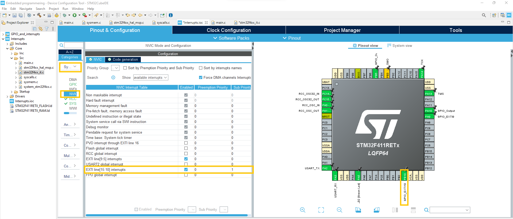

# Chapter 3. Interupts

In this chapter you will learn about:

- How to setup a interrupt handler.

- Toggle an led with a external interrupt tigger. 

- Set hierarchy of a interrupt handler. 

Interrupts is a way of either with hardware or software pause a processors current job (if premitted) and execute a time sensitive event. Most microcontrolles has a dedicated hardware for interrupts called Interrupts Service Routine(ISR). 

If you want more information about interrupts wikipedia has a good artikel: https://en.wikipedia.org/wiki/Interrupt 


## Exercise 1: Setup a interrrupt handler.

First we need to setup GPIOB pin 10 as a interrupt and set the GPIO pin as a pull down as is was shown in the last chapter. To setup the interrupt you need to go to the "pinout & configuration", then find PB10 on the MCU and select "GPIO_EXTI10". 

<p align="center">
    
</p>

Then code for the interrupt on GPIOB pin 10 will be generated. First we see a function in  "stm32f4xx_it.c" that handels interrupts on the lines from 10 to 15. 

```c
/**
  * @brief This function handles EXTI line[15:10] interrupts.
  */
void EXTI15_10_IRQHandler(void)
{
  /* USER CODE BEGIN EXTI15_10_IRQn 0 */
  
  /* USER CODE END EXTI15_10_IRQn 0 */
  HAL_GPIO_EXTI_IRQHandler(GPIO_PIN_10);
  HAL_GPIO_EXTI_IRQHandler(B1_Pin);
  /* USER CODE BEGIN EXTI15_10_IRQn 1 */

  /* USER CODE END EXTI15_10_IRQn 1 */
}
```

This calls HAL_GPIO_EXTI_IRQHandler which is located in "stm32f4xx_hal_gpio.c". This function clears the interrupt flag and calls the ISR Handler callback function (HAL_GPIO_EXTI_Callback) with the trigged GPIO pin as a argument.

```c
/**
  * @brief  This function handles EXTI interrupt request.
  * @param  GPIO_Pin Specifies the pins connected EXTI line
  * @retval None
  */
void HAL_GPIO_EXTI_IRQHandler(uint16_t GPIO_Pin)
{
  /* EXTI line interrupt detected */
  if(__HAL_GPIO_EXTI_GET_IT(GPIO_Pin) != RESET)
  {
    __HAL_GPIO_EXTI_CLEAR_IT(GPIO_Pin);
    HAL_GPIO_EXTI_Callback(GPIO_Pin);
  }
}
```

This means HAL_GPIO_EXTI_Callback will be called every time our interrupt is high. 

## Exercise 2: Make a led toggle. 

First we are gonna repeart from Chapter 2, first setup GPIOB bin 5 as a GPIO output and remember to setup GPIOB pin 10 with a pull down resistor. 

The next step is to add the callback method in out main, as shown in the code snippet below.

```c
/* Private user code ---------------------------------------------------------*/
/* USER CODE BEGIN 0 */
void HAL_GPIO_EXTI_Callback(uint16_t GPIO_Pin)
{
    if(GPIO_Pin == GPIO_PIN_10)
    {
    HAL_GPIO_TogglePin(GPIOB, GPIO_PIN_5);
    }
}
/* USER CODE END 0 */

/**
  * @brief  The application entry point.
  * @retval int
  */
int main(void)
{
```

Now the led will toggle every time GPIO B pin 10 is high. 

Take out your breadboard, copy the schemeatic below and run the code.

<p align="center">
    
</p>


## Extra: Interupt hierarchy

If you are building a bigger system, with multiple interrupts. It is important to set the hierarchy of the interrupts. You have to decide which are most system and time critical. To modify it, go to "Pinout & Configuration" then open System core and NVIC. Here one can set a priority where "0" is top prority.

<p align="center">
    
</p>

