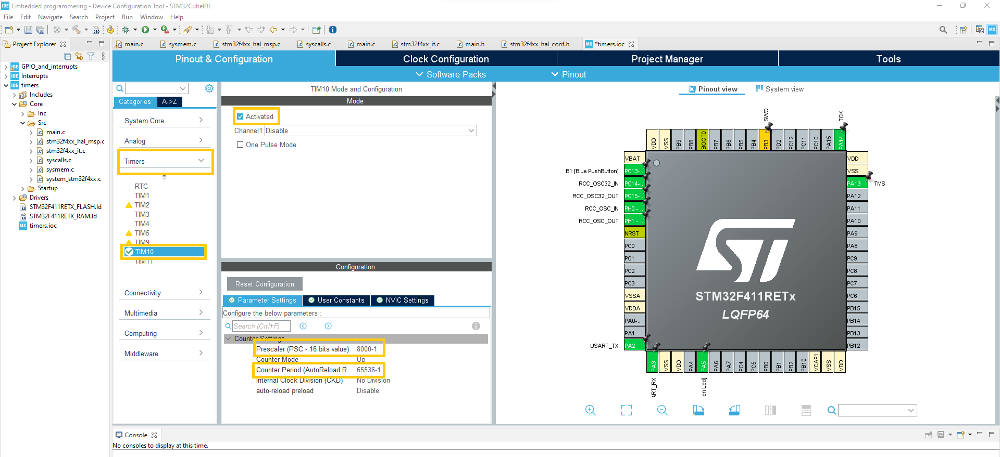
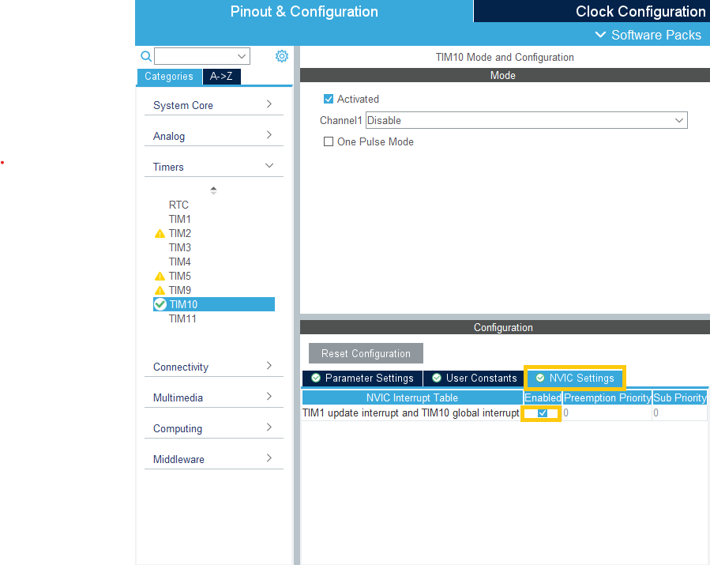

# Chapter 4 Timers
In this chapter you will learn about:

- Timers
- How to initialize a timer
- How to use timers to trigger an interrupt

## Introduction: Timers
Timers are used to reduce CPU power by removing the need for counting to another system, the timer. A MCU typically has multiple accesible timers that can be used for a variety of functions. A timer is a counter which counts to a set maximum value before it raises a flag and starts from 0 again. The count is increased by an input clock which typically needs to be downscaled to get increments in a frequency we want, this is done by initializing the timer with a prescaler. The prescaler is applied before the counter and divides the clock to further increase the range of the timer. If even further range is needed than what can be achieved by the prescaler a repetition counter can be added, which describes a number of times the timer resets instead of triggering an event.

## Setup: Initialize timer with STMCube
In this setup a NUCLE-F411RE board is used.
To initialize a timer in STM32CubeIDE the first step is to create a new project, open "Pinout and configuration" and go to the "Timers" tab in the left hand "Categories" panel.
Choose a target timer, in this example TIM10 will be used which is a 16-bit timer.
To activate the timer checkmark "Activated" and the last step is to set the initialization values. Setting the prescaler to "8000-1" will divide the clock by 8000 and setting the counter period to "65356-1" set the maximum number of counts in the counter to 63536 which is the maximum number of counts for a 16-bit counter.
Hitting save will autogenerate the code for this counter. NOTE: This only makes the counter available for use in your script but it does not start the timer.

<p align="center">
    
</p>


## Exercise: Use timer to trigger interrupt
This exercise will show how to use a timer together with an interrupt to make the on-board LED blink. Following the previous step to initialize the timer in the configuration the next step is to enable the interrupt, in the timer setting hit the "NVIC Settings" tab:
<p align="center">
    
</p>
In this tab check mark "Enabled" and save again.

Now to start the timer in interrupt mode add the following line under peripherals initialization (In the "User code 2"-section) 
```c
  HAL_TIM_Base_Start_IT(&htim10);
```
This way the timer has been started.

The next step is to define what should happen when the timer reaches the maximum count and triggers the interrupt, which is done by adding a callback function.
The callback function is added as a function in the "USER CODE 4"-section. As multiple interrupts can trigger the callback function an IF-statement is used to make sure that the LED  is toggled only when it is triggered by TIM10. NOTE that the function name must have the exact same spelling as it is defined in "stm324xx_hal_tim.h" or see below:

```c
/* USER CODE BEGIN 4 */

void HAL_TIM_PeriodElapsedCallback(TIM_HandleTypeDef *htim){
	if(htim == &htim10)
	{
		HAL_GPIO_TogglePin(LD2_GPIO_Port,LD2_Pin);
	}
}


/* USER CODE END 4 */
```

After initializing the timer, enabling the interrupt and adding code in the two places the code can be uploaded to the board and the on-board LED should blink (with frequency depending on clock, prescaler and counter period.)