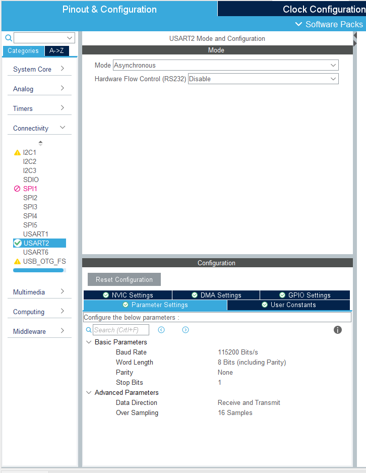
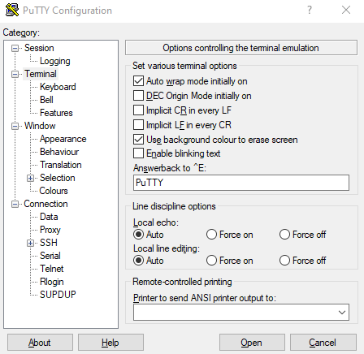

In this chapter you will learn about:

- How to Configure Usart.

- Setup Putty for serial communication.

- How to transmit over serial from the nucelo board.
    - Transmit using POLL method
    - Transmit using interrupt
    - Transmit using DMA

- How to receive from serial on the nucelo baord.

    - Receive with POLL method
    - Receive with interrupt
    - Receive with DMA

## Configure Usart on the nucleo
When we created the project, usart was setup with standard settings. The auto generated code can be found in main.c 

```c
/**
  * @brief USART2 Initialization Function
  * @param None
  * @retval None
  */
static void MX_USART2_UART_Init(void)
{

  /* USER CODE BEGIN USART2_Init 0 */

  /* USER CODE END USART2_Init 0 */

  /* USER CODE BEGIN USART2_Init 1 */

  /* USER CODE END USART2_Init 1 */
  huart2.Instance = USART2;
  huart2.Init.BaudRate = 115200;
  huart2.Init.WordLength = UART_WORDLENGTH_8B;
  huart2.Init.StopBits = UART_STOPBITS_1;
  huart2.Init.Parity = UART_PARITY_NONE;
  huart2.Init.Mode = UART_MODE_TX_RX;
  huart2.Init.HwFlowCtl = UART_HWCONTROL_NONE;
  huart2.Init.OverSampling = UART_OVERSAMPLING_16;
  if (HAL_UART_Init(&huart2) != HAL_OK)
  {
    Error_Handler();
  }
  /* USER CODE BEGIN USART2_Init 2 */

  /* USER CODE END USART2_Init 2 */

}

```

In the given code snippet we can see: 
(Skal skrive om, mangler info)
- we are using USART2
- baudrate is set to 115200
- 8 bit
- parity is none
- tx rx
- flow ctl none
- oversampling is to 16

This is the standard settings for alot of devices, but if you need to change these paramertes. You need to go the the "Pinout & configuration" tab again. Then go to, connectivity -> USART2 -> Parameter settings. Here one can modify the diffrent parameters. After changing them, press "ctrl + s" and then new configeration will be gernerated. 


<p align="center">
    
</p>


## Setup putty to send commands.

First we need to setup putty to be able to send serial commands to our nucleo board. Set com port, baud rate and etc., like you did in chapter 1. Click on Terminal in the option menu to the right. Here we need to enable "implicit CR in every LF", local echo to "Force on". (see image)

<p align="center">
    
</p>


