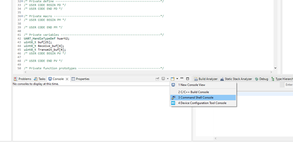
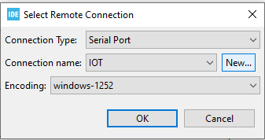

# Chapter 5. UART!

In this chapter you will learn about:

- How to Configure UART.

- Setup STM32CubeIDE for serial communication

- How to transmit over serial from the nucelo board.
    - Transmit using POLL method
    - Transmit using interrupt

- How to receive from serial on the nucelo baord.
    - Receive with POLL method
    - Receive with interrupt

In embedded communication we have two main catorigies, serial and parallel communication. In this chapter the focus will be serial communication, with the protocol USART(Universal Synchronous Asynchronous Receiver Transmitter) and UART(Universal Asynchronous Receiver Transmitter). The diffrence between USART and UART is that USART can run in both asynchronus mode as the UART and run in synchronus mode. Our nucelo board has a USART connector but we will run the examples, in asynchronus mode.

Later in chapter 8, there will be a introduction to DMA(Direct Memory Access), which is used a lot in serial communication. DMA is very useful when you have large amount of data, and want a non blocking method, but that will not be covred in this chapter.

## Configure uart on the nucleo
When we created the project, uart was setup with standard settings. The auto generated code can be found in main.c and is shown below.

```c
/**
  * @brief USART2 Initialization Function
  * @param None
  * @retval None
  */
static void MX_USART2_UART_Init(void)
{

  /* USER CODE BEGIN USART2_Init 0 */

  /* USER CODE END USART2_Init 0 */

  /* USER CODE BEGIN USART2_Init 1 */

  /* USER CODE END USART2_Init 1 */
  huart2.Instance = USART2;
  huart2.Init.BaudRate = 115200;
  huart2.Init.WordLength = UART_WORDLENGTH_8B;
  huart2.Init.StopBits = UART_STOPBITS_1;
  huart2.Init.Parity = UART_PARITY_NONE;
  huart2.Init.Mode = UART_MODE_TX_RX;
  huart2.Init.HwFlowCtl = UART_HWCONTROL_NONE;
  huart2.Init.OverSampling = UART_OVERSAMPLING_16;
  if (HAL_UART_Init(&huart2) != HAL_OK)
  {
    Error_Handler();
  }
  /* USER CODE BEGIN USART2_Init 2 */

  /* USER CODE END USART2_Init 2 */
}

```

In the given code snippet we can see: 
- we are using USART2 in asynchronus mode. This means we need to set the following settings
- Since we dont have a shared clock we need to specify how fast the data is transfed . This is called the baudrate, in this example we are gonna set it to 115200.
- Then we need to set the size of the data chuncks, the most common is 8 bit.
- parity bits is a simple form of error dectection in data transfer. If you have a noisy enveriment it could be a good idea to enable, but in this example we will set it to None.
- The stop bits also called synchroizationbits is the number of bits to be set in the end of a data packet. This is normally set to 1.

This is the standard settings for alot of devices, but if you need to change these paramertes. You need to go the the "Pinout & configuration" tab again. Then go to, connectivity -> USART2 -> Parameter settings. Here one can modify the diffrent parameters. After changing them, press "ctrl + s" and then new configeration will be gernerated. 


<p align="center">
    
</p>

## setup console for serial communication
For serial communication, there is a wide variety of programs available. In this chapter we are gonna use the buildin console.
STM32CubeIDE has a bulidin console for serial communication. To open it clock on the console windown and command shell console, as shown in the iamge below.

<p align="center">
    
</p>

Then in the remote connection window click on "new"

<p align="center">
    
</p>

Give your connection a name and go to device manager and find which com port your device is on. In serial port, pick the com port your device is on and set the settings to the same as indecated in the previuos section. 

<p align="center">
    
</p>

Then press finsh and ok. 

## Transmit using POLL method

Poll method is the most simple way of transferring data. The down side of poll is, while transmitting the data it will block all other operation. The good thing about poll is, its good for transferring large amount of data simple and good if the programs jobs are only transferring over UART. 

The setup for poll is simple and was the one we used in chapter 1. The code snippet below shows a basic setup.

-  First we include string.h

``` c
/* Private includes ----------------------------------------------------------*/
/* USER CODE BEGIN Includes */
#include "string.h"
```

- Define a buffer

```c
int main(void)
{
  /* USER CODE BEGIN 1 */
	uint8_t buf[25];
```

- Then Copy a string to our buffer and transmit it.

```C
  /* Infinite loop */
  /* USER CODE BEGIN WHILE */
  while (1)
  {
	  strcpy((char*)buf, "Hello world\r\n");
	  HAL_UART_Transmit(&huart2, buf, strlen((char*)buf), HAL_MAX_DELAY);
	  HAL_Delay(1000);
```

In the code above we give HAL_UART_Transmit "HAL_MAX_DELAY" as a argument. This is the timeout timespan for the task. This is needed for any blocking process. HAL_MAX_DELAY timespan is multipel days and is only used if you dont care how long you are blocking. When you using poll you need to consider the timespan needed for your task, if the timespan is too short the task will terminated and the remaing data won't be sendt. 

Then to resolve this problem we can use interupt or DMA for transmitting the data.

## Transmit using Interrupt

The first step for setting up the UART interrupt is to enable it in NVIC Settings, go to Pinout & Configuration -> Connectivity -> USART2( or whatever port you are using) -> NVIC Settings. (See image below) Then press "ctrl + s" and generate the new code.

<p align="center">
    
</p>

Then to transmit in interrupt mode call "HAL_UART_Transmit_IT". In the example below, a led is toggle every second, just as we did it in chapter 1., but this time we dont want to add the delay from transmitting with POLL. We do this by using interrupt mode and run the tranmission in the background.   

```c
  /* Infinite loop */
  /* USER CODE BEGIN WHILE */
  while (1)
  {
	  strcpy((char*)buf, "Hello world\r\n");
	  HAL_UART_Transmit_IT(&huart2, buf, strlen((char*)buf));
	  HAL_Delay(1000);

```

One can then add "HAL_UART_TxCplitCallBack" outside of the main function. This function gets call when the interrupt transmission is completed. In the given code snippet below, HAL_UART_Transmit_IT is called again every time it completes. 

```c
/* Private user code ---------------------------------------------------------*/
/* USER CODE BEGIN 0 */
void HAL_UART_TxCpltCallback(UART_HandleTypeDef *huart)
{
	HAL_UART_Transmit_IT(&huart2, buf, strlen((char*)buf));
}
```

## Receive with POLL method
POLL method is the most simple way of receiving data over UART. Just as in the transmit part, we can receive with POLL with the default settings of the project. 

In this example we are gonna show how to Receive a string and tell about the pitfalls.

- First lets create 2 buffers

```c
/* Private variables ---------------------------------------------------------*/
uint8_t Receive_buf[4];
```

- Then in the main loop add HAL_UART_Receive()

```c
  /* Infinite loop */
  /* USER CODE BEGIN WHILE */
  while (1)
  {
	  HAL_UART_Receive(&huart2, Receive_buf, 10, 1000); 
```

In this code snippet we are receiving over UART for 1000 miliseconds(Timeout), for a message that is 10 bytes long. Here it is important to remeber that this is blocking our system for 1000 miliseconds and if you have a buffer that takes longer to read then you timeout, you won't get the whole message. 

To test this, set a break point at the uart receive line and setup console as described earlier. Then cehck what get writing to the buffer.

## Receive with Interrupt

To setup the interrupt on UART for receiving, we do the same as in the transmission part. Then just as in the tranmission part we start with setup our UART receive interrupt. 

```c
  /* Initialize all configured peripherals */
  MX_GPIO_Init();
  MX_USART2_UART_Init();
  /* USER CODE BEGIN 2 */
  HAL_UART_Receive_IT (&huart2, Receive_buf, 4);
```

Then outside of our main we define our callback function, and call the UART receive interrupt again. If not the system will stop listining after the first interrupt. 

```c
/* Private user code ---------------------------------------------------------*/
/* USER CODE BEGIN 0 */
void HAL_UART_RxCpltCallback(UART_HandleTypeDef *huart) 
{
  HAL_UART_Receive_IT(&huart2, Receive_buf, 4); 
}
```

With this method we have a non blocking way of continously listen for serial input. 

Then to test the code, set a breakpoint in the callback method and run the program in debug mode. 


