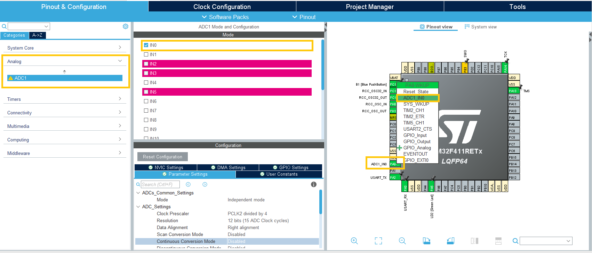

# Chapter 6. Analog-to-digital-conversion
In this chapter you will learn about analog-to-digital-conversion (ADC) in the following topics:

- Introduction to ADC
- How to initialize an ADC
- How to use ADC to read a measurement

## Introduction: ADC 
Microcontrollers use ADCs to convert analog input from sensors to digital processable values.
The conversion is done by comparing the measured voltage with a reference voltage using a comparator, meaning it is not possible to measure analog values higher than this reference. One thing to consider is the resolution of the ADC as a sensor can be extremely precise but the ADC can only measure down to it's resolution. The resolution of an ADC is the reference range (For NUCLEO-F411RE: 0-3.3V) and the precision (for Nucleo-F411RE this is 12 bits - 4096 steps).

## Setup: ADC
Using stm32cubeIDE with a NUCLEO-F411RE board. To enable the ADC go to  "Pinout and Configuration" and click on one of the pins that is connected to the ADC eg. PA0, and choose "ADC1-INx" on the drop down menu. Now in the "Analog"-tab it can be seen that input x is active for ADC1 and in the "Configuration" more choices can be made if needed.
<p align="center">
    
</p>


## Exercise: How to use ADC to read a measurement
Next up is to show how the ADC can be used to read a value. After enabling the ADC as described in the section before and autogenerating the code, the next step is to build a simple setup and add a few lines of code in "main.c".

The circuit is a potentiometer connected to 3.3V, PA0 and GND.

To be able to print the measured values we include the following the libraries:

```c
#include <string.h>
#include <stdio.h>
```

After including the required libraries the ADC and UART objects:

```c
/* Private variables ---------------------------------------------------------*/
ADC_HandleTypeDef hadc1;

UART_HandleTypeDef huart2;
```
And to be able to read and print variables must be declared for this:

```c
 /* USER CODE BEGIN 1 */
	uint16_t raw;
	char msg[10];

  /* USER CODE END 1 */
```
The last code that must be added is to start the ADC read directly from the ADC pin and transmitting this with UART:

```c
/* USER CODE BEGIN WHILE */
  while (1)
  {

	  //Get ADC Value
	  HAL_ADC_Start(&hadc1);
	  HAL_ADC_PollForConversion(&hadc1,HAL_MAX_DELAY);
	  raw = HAL_ADC_GetValue(&hadc1);

	  //Print
	  sprintf(msg, "%hu\r\n",raw);
	  HAL_UART_Transmit(&huart2,(uint8_t*)msg,strlen(msg),HAL_MAX_DELAY);
	  HAL_Delay(1);
	  /* USER CODE END WHILE */
```
Running the code now and opening a serial communicaiton (through Putty or stm32cubeIDE) the analog values can be seen and by turning the potentiometer the value should change.