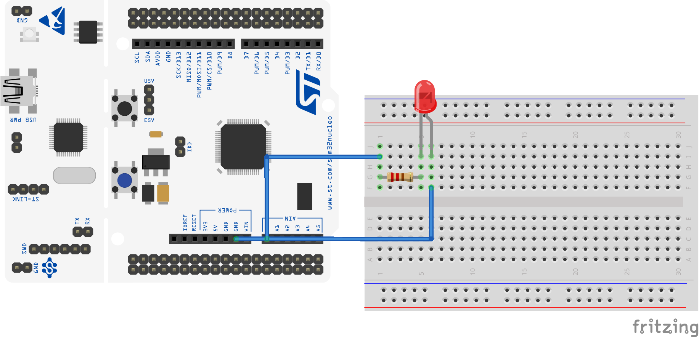

# Chapter 7. Pulse width modulation
In this chapter you will learn to setup pulse width modulation (PWM) in STM32CubeIDE:

- Setup timer for PWM
- Dimming a led

PWM is one of the core functions of timers, used in a variaty of applications. In short it consist of a pulse running at a certain frequency, where one can vary the witdh of the pulse. This means that one can set the pulse to only be high 10 % of the time, which gives a duty cycle of 10. 

For a more in-depth explanation read Deepblueembedded's artikel: https://deepbluembedded.com/stm32-pwm-example-timer-pwm-mode-tutorial/

## Setup: Setup timer for PWM

First we need to setup our timer for PWM. We are gonna use timer2 for this. Set the clock source to the internal clock and channel 1 to PWM Generation, this enables PA0 as the pwm output. Then in parameter setttings we are gonna set the prescaler to 84-1 since we want a nice clock at 1 mHz, and then set our clock period to 100-1, which gives use a pwm frequency of 10 kHz. Save the settings and generate the new code.

<p align="center">
    
</p>


## Exercise: Dimming a led

In this exerise we are gonna use pwm for dimming an LED. Here we are gonna use the HAL library again. We are gonna use HAL_TIM_PWM_START. If you have a time critical application, where you need to update the pwm, you should use HAL_TIM_PWM_START_IT or HAL_TIM_PWM_START_DMA.

In the code snipped below, we set the pwm duty cycle register to 10. This gives us a duty cycle of 60. Then we use HAL to enable our pwm generation. Now run the code at probe GPIO pin PA0 with a digital analyser or oscilloscope.  
```c
  /* Initialize all configured peripherals */
  MX_GPIO_Init();
  MX_USART2_UART_Init();
  MX_TIM2_Init();
  /* USER CODE BEGIN 2 */
  TIM2->CCR1 = 10; // set duty cycle of 10 %
  HAL_TIM_PWM_Start(&htim2, TIM_CHANNEL_1); // init pwm
```
Here we will see that our pwm has a frequency of 10 Khz and a duty cycle of 10. Now lets try to add a LED to our pwm signal and make a simple code that dimmes the led.

<p align="center">
    
</p>

We are gonna make two while loops, in which we make steps of 2 up and down in our duty cycle.

```c
  /* Infinite loop */
  /* USER CODE BEGIN WHILE */
  while (1)
  {

      while(duty_cycle < 100)
      {
          TIM2->CCR1 = duty_cycle;
          duty_cycle += 2;
          HAL_Delay(10);
      }
      while(duty_cycle > 0)
      {
          TIM2->CCR1 = duty_cycle;
          duty_cycle -= 2;
          HAL_Delay(10);
      }

```

Then setup your cirtuit as shown below and run the program.

<p align="center">
    
</p>
