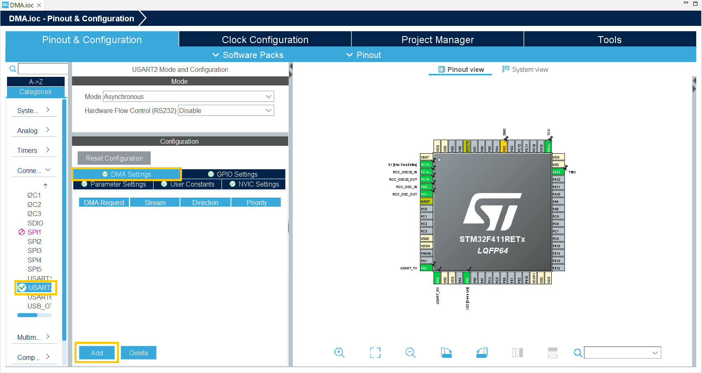

# Chapter 8. Direct-Memory-Access
In this chapter you will learn about direct-memory-access (DMA):

- What direct memory access is
- How to setup DMA 
- How to use DMA to receive an input

## Introduction: What DMA is
The DMA is a module that is connected directly to the memory bus in parallel with the CPU meaning that data can be stored or read using the DMA instead of using CPU clock cycles on it. This is useful in many situations such as previous topics UART and ADC.

## Setup: How to enable the DMA
In stm32cubeIDE the DMA is enabled in "Pinout and Configuration" under the configuration tab of the module where it will be used. To enable the DMA for UART click on the enabled UART connection "USART2" in the left most panel under "connectivity". Under configuration of "USART2" choose the "DMA settings" and click on "Add":

<p align="center">
    
</p>

Next is to choose if the DMA should be used for recieving or transmitting as the following example only will be using receiving then RX is chosen:

<p align="center">
    
</p>

If transmitting is required this can be done by pressing "Add" once more and choosing TX.

## Exercise: How to use DMA to receive an input
After setting up the DMA together with the UART as described in the previous section the use of the DMA can be tested by using it to receive directly from the input of a serial communication (either putty or through stm32cubeIDE).
The first thing to do is to declare the required objects and variables, an uart object to print, a uart object to receive and an array of lenght 3 to read input. This array could have any length but in this example it must be full before it is printed for this example 3 is a useful length, not too long, not too short.

```c
/* Private variables ---------------------------------------------------------*/
UART_HandleTypeDef huart2;
DMA_HandleTypeDef hdma_usart2_rx;

/* USER CODE BEGIN PV */
uint8_t UART2_rxBuffer[3] = {0};

/* USER CODE END PV */
```
The next thing is to make sure that the DMA is initialized before the UART this is autogenerated from the configuration tab but stm32cubeIDE might accidently initialize UART before DMA and then it does not work, it should look like this:

```c
  MX_DMA_Init();
  MX_USART2_UART_Init();
```

After initializing the DMA and UART lets use the DMA to receive a user input which is done by the following call:

```c
  /* USER CODE BEGIN 2 */
  HAL_UART_Receive_DMA (&huart2, UART2_rxBuffer, 3);
  /* USER CODE END 2 */
```

Now to read the output and make it possible to read more values lets use a callback function for the UART receive. This function is run when the UART has received the data and the first line of the function transmits whatever the UART received to a terminal and the second line listens for user input again so this function keeps repeating itself.

```c
/* USER CODE BEGIN 4 */

void HAL_UART_RxCpltCallback(UART_HandleTypeDef *huart)
{
    HAL_UART_Transmit(&huart2, UART2_rxBuffer, 3, 100);
    HAL_UART_Receive_DMA(&huart2, UART2_rxBuffer, 3);
}

/* USER CODE END 4 */
```
Uploading the code and opening a terminal then typing 3 characters like "aaa" in the terminal will make the Nucleo-board respond with the exact same characters and "aaa" will be printed in the terminal. It should be noted that all characters must be typed before they are printed as the callback function isn't called before the specified number of characters have been received.


