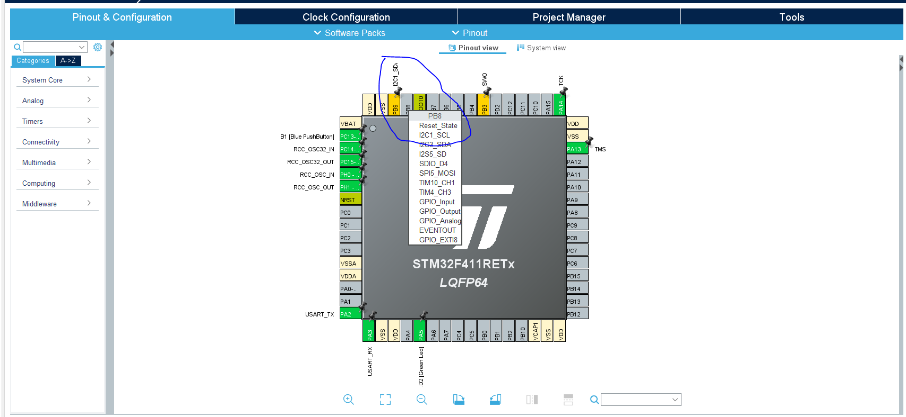
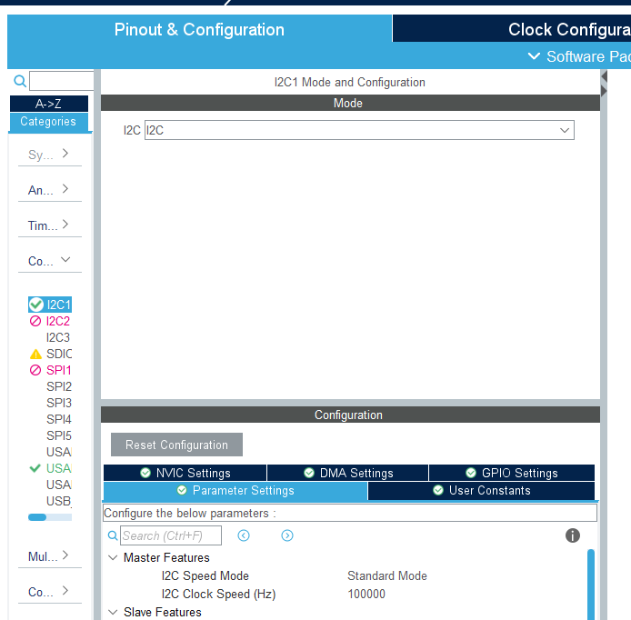

# Chapter 9. I2C - Inter-integrated Circuit

This chapter consist of

- How to setup I2C in STM32CubeIDE

- How to transmit over I2C 

- How to receive over I2C

I2C also called IIC is synchronous serial communication bus. It uses to pins to transmit data, Serial Data (SDA) and Serial Clock (SCL). SDA is the data transreciver line to send and receive data. SCL is the serial clock to carrie the clock signal.

For a more in-depth explanation, circuitbasics has a good artikel: https://www.circuitbasics.com/basics-of-the-i2c-communication-protocol/


## Setup I2C in STM32CubeIDE

Normally a stm32 mcu has multiple I2C busses. In this example on the nucleo-f411RE board we are gonna use I2C1, which means we are using I2C bus one. As it can be seen in the image below, we start with setting PB9 to SDA and PB8 to SCL

<p align="center">
    
</p>

Then go to connectivity -> I2C1 and set I2C mode to I2C. In this example we are gonna use the deafult settings, but down in configuration, one can change the speed enable DMA as shown in chapter 8 and much more. ´

<p align="center">
    
</p>

## Transmit and Receive data over I2C

In our example we are gonna write and read from the temperature sensor MCP9801. In order to comminicate with the device we first need to find some values from the datasheet. First the sensors I2C address and the temperature register. 

```c
const int MCP980X_ADDR = 0x48 << 1; // IC address
const int REG_TEMP = 0x00; //Temprature register
```

Then we need to create a buffer for our data, a status variable and a response variable

```c
int main(void)
{
  /* USER CODE BEGIN 1 */
	HAL_StatusTypeDef status;
	uint8_t buf[20];
	int16_t response;
  /* USER CODE END 1 */

```
Now we transmit one byte with the function from the HAL libary HAL_I2C_Master_Transmit. Hhis tells our IC that we want to read the temperature, and check wheter the transmission succeed. 

```c
  while (1)
  {
	  buf[0] = REG_TEMP;
	  status = HAL_I2C_Master_Transmit(&hi2c1, MCP980X_ADDR, buf, 1, HAL_MAX_DELAY);
      if (status != HAL_OK)
	  {
		  // do something
	  }
```

Next step is to receive the data from the sensor. For this we use HAL_I2C_Master_Receive and we add the following to the while loop. 

```c

	status = HAL_I2C_Master_Receive(&hi2c1, MCP980X_ADDR, buf, 2, HAL_MAX_DELAY);
    if (status != HAL_OK)
    {
          // do something
    }

```


