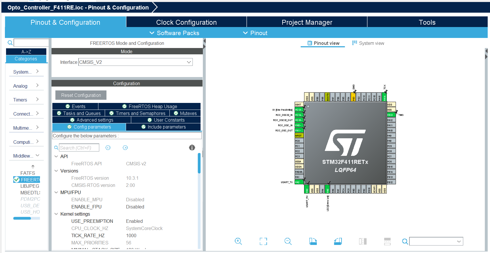
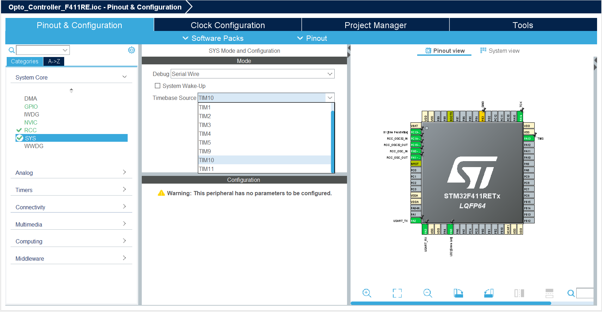

# Chapter 3. Interupts
In this chapter you will learn about Real Time Operating System:
- What is RTOS
- How to setup RTOS 
- How to setup two tasks in RTOS

## Introduction: What is RTOS
Usually a microcontroller is run in a superloop which loops over the same actions in the same order time after time. Another possibility is to run a RTOS which handles actions depending on their priority in the system. In RTOS the actions are put into their own thread called a task and each is assigned with a priority. A task is started by calling an entry function which starts the task this way multipl tasks can be started at the same time but the one with the highest priority will be executed. If a high priority task is started it will pause low priority tasks and execute before resuming to the low priotity task again. This way RTOS can handle time critical events by changing between tasks giving more options compared to the superloop.

## Info: Setup RTOS
To use RTOS in a project is recommended to enable RTOS in the STM32CubeIDE when the project is initialized as it changes the architecture of the project.
To activate RTOS in the STM32CubeIDE move to the pinout and configuration tab. Under the category "Middleware" choose the subgroup "FREERTOS" and set interface to "CMSIS_V2" as seen in the Figure below:

<p align="center">
    
</p>

Stay under FREERTOS and choose the configuration tab "Tasks and queues" in this tab tasks are added. Add a new task by clicking on "Add" and choose a name and priority.
The next thin to do is to go to advanced 
Before compiling the timer must be changed as both RTOS and HAL_Delay() are based on the SysTick timer by default which will cause timing issues. To fix this go to the category "System Core" and choose the subgroup "SYS" under Mode set Timebase Source to a simple timer ie. TIM10 or TIM11 for F411RE as these timer only counts up. as seen in the figure below:

<p align="center">
    
</p>

 This will change the timer used in HAL_Delay() now hit save to generate the code.   

## Exercise: Setup two tasks
Now to test RTOS in a very simple example setup RTOS as described in the previous section and add two tasks: blinkFast and blinkSlow. For blinkFast the entry function will be called Blink500 with priority level "osPriorityNormal" and for blinkSlow the entry function will be called Blink750 with priority level osPriorityBelowNormal as seen in the figure below:
<p align="center">
    
</p>
This way the thread blinkFast will take priority over the thread blinkSlow.
Now generating the code from the configuration tab and moving to main.c it can be seen that the threads are defined at the top:

```c
/* Definitions for blinkFast */
osThreadId_t blinkFastHandle;
const osThreadAttr_t blinkFast_attributes = {
  .name = "blinkFast",
  .stack_size = 128 * 4,
  .priority = (osPriority_t) osPriorityNormal,
};
/* Definitions for blinkSlow */
osThreadId_t blinkSlowHandle;
const osThreadAttr_t blinkSlow_attributes = {
  .name = "blinkSlow",
  .stack_size = 128 * 4,
  .priority = (osPriority_t) osPriorityBelowNormal,
};
/* USER CODE BEGIN PV */
```
A bit further down the entry functions are defined.

```c
void Blink500(void *argument);
void Blink2000(void *argument);
```

And then RTOS is initialized by:

```c
osKernelStart();
```

Now RTOS is in control and no code should be added to the main loop. Instead all code should be added to the entry functions which also have a forever loop. Now adding the following code to the two entry functions to make the onboard LED toggle every 500 ms and 750 ms respectively in the two tasks. And when they overlap the 500 ms toggle will have priority over the 750 ms toggle:

```c
/* USER CODE BEGIN 4 */

/* USER CODE END 4 */

/* USER CODE BEGIN Header_Blink500 */
/**
  * @brief  Function implementing the blinkFast thread.
  * @param  argument: Not used
  * @retval None
  */
/* USER CODE END Header_Blink500 */
void Blink500(void *argument)
{
  /* USER CODE BEGIN 5 */
  /* Infinite loop */
  for(;;)
  {
	  HAL_GPIO_TogglePin(GPIOA,GPIO_PIN_5);

    osDelay(500);
  }

  osThreadTerminate(NULL);
  /* USER CODE END 5 */
}

Second function:
void Blink750(void *argument)
{
  /* USER CODE BEGIN Blink750 */
  /* Infinite loop */
  for(;;)
  {
	HAL_GPIO_TogglePin(GPIOA,GPIO_PIN_5);
    osDelay(750);
  }

  osThreadTerminate(NULL);
  /* USER CODE END Blink750 */
}

```

The osDelay() is delay function that lets RTOS do other tasks while the delay is getting handled. And osThreadTerminate cleans up the thread in case it is exited. 
Now building the code and uploading it to the board it can be seen that the onboard LED starts blinking in a pattern with one quick blink and then one longer period either on or off as the two threads are running simultaneously.