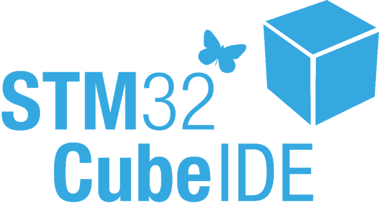

# STM32-Getting-started

    

This repository is a product from a course at Denmarks Technical University. The purpose of this repo is give a introduction to the stm32CubeIde on any stm32 developer board.

# Chapter 1 Hello world!

# Chapter 2 GPIO

# Chapter 3 Interrupts

# Chapter 4 Timers

# Chapter 5 Communication xx

# Chapter 6 ADC & DAC

# Chapter 7 Pulse Width Modulation

# Chapter 8 Direct Memory Access

